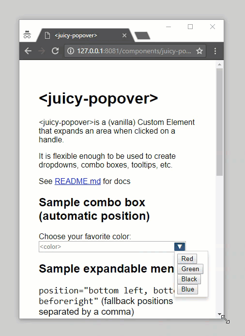

# &lt;juicy-popover&gt;

`<juicy-popover>` is a (vanilla) Custom Element that expands an area when clicked on a handle.

It is flexible enough to be used to create dropdowns, combo boxes, tooltips, etc.

## Demo

[Check it live!](http://juicy.github.io/juicy-popover)



## Usage

1. Install the component using [Bower](http://bower.io/):

    ```sh
    $ bower install juicy-popover --save
    ```

2. Import Web Components' polyfill (optional, allows to run it in old browsers):

    ```html
    <script src="//cdn.jsdelivr.net/webcomponentsjs/0.5.5/webcomponents.min.js"></script>
    ```

3. Import Custom Element:

    ```html
    <link rel="import" href="bower_components/juicy-popover/src/juicy-popover.html">
    ```

4. Start using it!

    ```html
      <juicy-popover position="bottom left">
        <button slot="handle">▼</button>
        <div slot="expandable">
          You only see me when the button is pressed
      </juicy-popover>
    ```

## Attributes

Attribute            | Type           | Default       | Description
---                  | ---            | ---           | ---
`position`           | *String*       | `bottom left, bottom beforeright, beforetop left, beforetop beforeright` | Position of the expandable after the handler is pressed. If multiple positions are provided (separated by comma), the first position that fits within the viewport will be used.
`disabled`           | *Bool*         | `false`       | If true, element won't expand. If already expanded, it will collapse once set to true. Synchronised with property `disabled`
`expanded`           | *Bool*         | `false`       | Determines whether it's expanded. Synchronised with property `expanded` and event `expanded-changed`

## Positions

Positon              | Description
---                  | ---    
`top`                | Position the top of the expandable at the top of the handler
`beforetop`          | Position the bottom of the expandable at the top of the handler
`bottom`             | Position the top of the expandable at the bottom of the handler
`beforebotom`        | Position the bottom of the expandable at the bottom of the handler
`left`               | Position the left of the expandable at the left of the handler
`beforeleft`         | Position the right of the expandable at the left of the handler
`right`              | Position the left of the expandable at the right of the handler
`beforeright`        | Position the right of the expandable at the right of the handler

## Slots
Name                 | Description
---                  | ---
`handle`             | Slot to set on the handle child node in `<juicy-popover>` light DOM
`expandable`         | Slot to set on the expandable child node in `<juicy-popover>` light DOM

## Methods

Name               | Param name | Type      | Description
---                | ---        | ---       | ---
`expand`           |            |           | Expand the expandable
`collapse`         |            |           | Collapse the expandable
`reposition`       |            |           | Repositions popover

## [Contributing and Development](CONTRIBUTING.md)

## License

MIT
